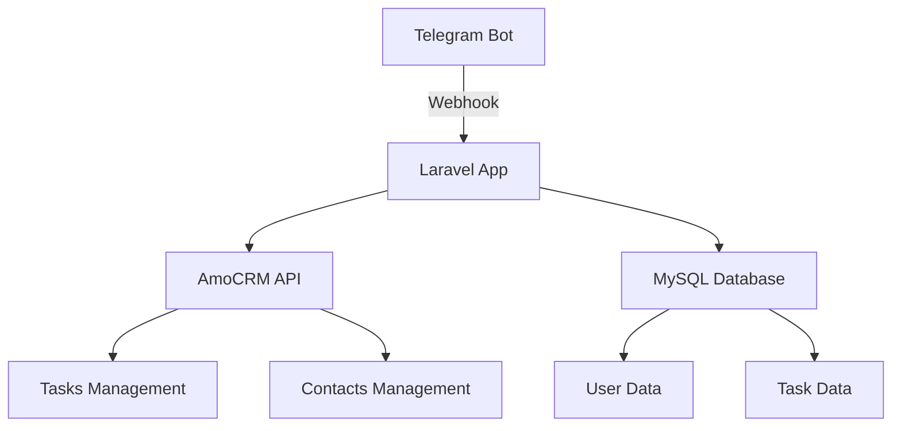

# План реализации Telegram бота для AmoCRM

## Технологический стек
- PHP 8.1+
- Laravel 10.x
- Telegram Bot API
- AmoCRM REST API
- MySQL 5.7+

## Архитектура

## Этапы реализации

### 1. Настройка проекта
- Установка Laravel
- Конфигурация .env
- Настройка пакетов:
  - telegram-bot/api
  - amocrm/amocrm-api-php

### 2. Telegram бот
- Регистрация бота через @BotFather
- Настройка вебхука
- Система интерактивных кнопок:
  - Создание задач
  - Просмотр статусов
  - Закрытие задач
- Обработка медиафайлов

### 3. Интеграция с AmoCRM
- OAuth 2.0 авторизация
- Создание:
  - Сделок (задачи)
  - Контактов (сотрудники)
  - Примечаний (комментарии)
- Кастомные поля для:
  - Приоритетов
  - Групп
  - Статусов

### 4. Бизнес-логика
- Workflow для сотрудников:
  - Создание заявки → AmoCRM
  - Проверка статуса
  - Закрытие задачи
- Workflow для администраторов:
  - Настройка групп
  - Назначение прав
  - Мониторинг

### 5. Развертывание
- Требования к серверу:
  - PHP 8.1+
  - MySQL 5.7+
  - SSL сертификат
  - Выделенный IP
- Рекомендации:
  - Supervisor для процессов
  - Queue workers
  - Логирование
